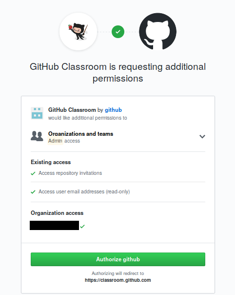
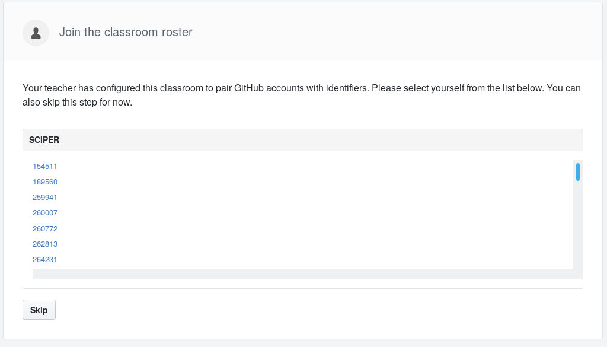
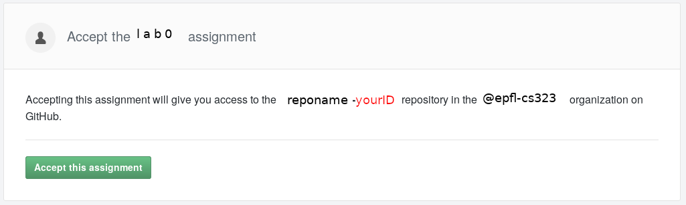

# Introduction to Operating Systems

<!-- Authors:
    Atri Bhattacharyya (atri.bhattacharyya@epfl.ch)
-->

## Introduction

Welcome to the project for CS-323. In this lab, we shall be implementing 
various operating system functions, such as scheduling, concurrency 
primitives and more. 

Our objectives for this week are:
1. Set up the lab environment
1. Introduction to the submission system via Github Classroom. 
1. Refresher exercises in C

## Lab environment 

All tests and grading of your assignments will be done inside this 
environment, therefore you should test your code in it before submitting. 
Any and all other platforms you wish to use (e.g., your laptop or home 
computer) will not be supported by the teaching team. The environment 
consists of a virtual machine (VM) of the Ubuntu desktops in EPFL’s lab 
rooms CO-02x, inside which you can use the EPFL myNAS service to store 
your files.

In your desktop, you will find two folders: `myfiles` and `posixfs`. 
Files in both folders will be persistent, i.e. files stored in these
folders will be available if you logout and log back in. Files stored
in any other folder in these VMs will be lost when you logout.
Files in `posixfs` can be executable, unlike those in `myfiles`. 
Therefore, it is recommended to use this folder to store your work for
this lab. Particularly, your files will need to be in this directory 
for scripts and makefiles to work. 

### From other machines

This section gives a sneak peek into how to access the virtual machine
from any computer besides those in CO. However, access by this method will
not be supported by the teaching team. 

On other machines, you should be able to access the VM from the 
browser at `https://vdi.epfl.ch/`. This provides you with a web interface 
to the VM if you choose the option `VMWare Horizon HTML Access`.

Alternately, you could access the VM by installing the VMWare Horizon Client. 
In this case, you will need to install the software available by choosing the
option `Install VMWare Horizon Client` at `https://vdi.epfl.ch/`. 
On running the client, you will need to connect to the server `vdi.epfl.ch` 
with your Gaspar login details and select the machine named IC-CO-IN-SC.

More information can be found at this 
[link](https://support.epfl.ch/help?id=epfl_kb_article_view&sys_kb_id=f7581e2adb4b978cef64731b8c961903).

## Github Classroom

We shall use Github classroom to distribute lab assignments for this course.
For each new lab, you will receive a link to the assignment. 
The first thing you need is a GitHub account. If you do not have one,
you can create it [here](https://github.com/join). You can use a 
free account, there is no need for a paid version. If you already have
an account, feel free to use it for this course.

Once you have a GitHub account, you must register for the assignments using 
a specific link which we shall provide (and will look like 
https://classroom.github.com/a/71uysUdE). Once you open the link, you may
be asked to provide the permissions to GitHub Classroom to access your
repositories. 

Then you will have to choose your SCIPER number from a list. If you are enrolled
for the course but your SCIPER does not appear on this list, contact a TA.

Thereafter, you will be able to join the first lab (lab 0).

Once this is done, you should receive a message from GitHub telling you that 
you have joined the "Lab 0" assignment and you have in your GitHub repositories 
a `os19-lab0-YOUR_GITHUB_ID` repository whose URI should look like this:
`git@github.com:epfl-cs323/os19-lab0-YOUR_GITHUB_ID.git`.

For this URI to work, you must register your SSH public key in GitHub. 
You can [do it here](https://github.com/settings/ssh) by following the
instructions from this 
[help page](https://help.github.com/en/articles/connecting-to-github-with-ssh).

Finally, you can 
[clone](https://help.github.com/en/articles/cloning-a-repository) 
the repository onto your own machine and start working on the lab exercises.

## Lab 0, week 1

For every assignment, we shall provide you starter code in the `provided/` 
directory. *Do not edit* any files within this directory. Copy the 
contents of this folder into a new folder: `done/` and make changes there.
*Only* files found in `done/` will be considered for grading. Remember to 
commit your work regularly. The final state of the repository at the 
deadline will be considered for grading. 

*Hint: You can use git branches to commit work-in-progress without affecting your
submission on the master branch.* 
[Branching tutorial](https://git-scm.com/book/en/v1/Git-Branching-What-a-Branch-Is)

In this week, we provide the following files:
1. `provided/week01.h`: Header file for the exercises
1. `provided/week01.c`: Implementation for the exercises. Look at the TODOs
in this file.
1.`provided/tests.c`: Skeleton for unit testing. Add your own tests here.
1. `provided/Makefile`: For building your files. Run `make feedback` to run
unit tests.

There are 4 exercises. The first exercise requires you to implement a simple
string comparison function. To see the expected behavior, consult the manpage
for `strcmp` (`man strcmp`). This is to familiarize yourself with C character
arrays/strings.

The second exercise requires debugging a simple linked list implementation in 
which there are two simple bugs. You have to fix them. Both bugs are a 
one-line fix. The third exercise requires printing a provided binary tree 
with different orderings. These exercises are to help you recollect working
with C pointers.

Finally, the last exercise is an alphabet frequency counter where you count
the number of occurences of each English letter in the text from a file.
This is meant to help you recollect file I/O.